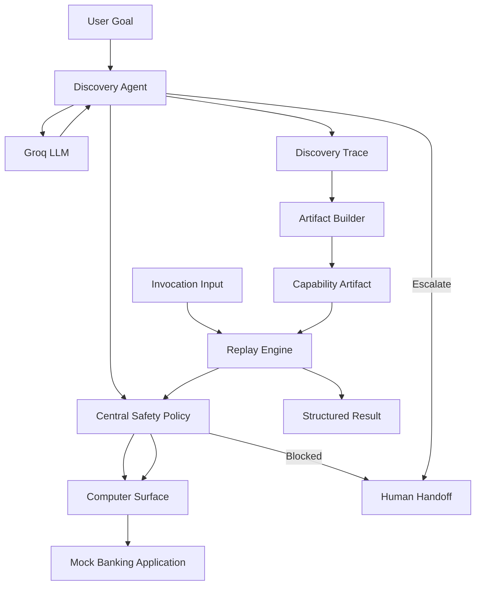

# Computer-Use Automation

A prototype computer-use automation system that separates **LLM-driven workflow discovery** from **deterministic production replay**.

The system demonstrates how an LLM can explore a live user interface once, convert the successful interaction trace into a reusable capability artifact, and subsequently execute that capability without invoking the LLM again.

The vertical slice uses a local mock banking application and implements the capability:

> Look up a member and return their current savings balance.

---

## Core Idea

Traditional browser agents may invoke an LLM during every execution.

This project uses a different architecture:

```text
Natural-language goal
        |
        v
LLM-driven discovery
        |
        v
Successful interaction trace
        |
        v
Artifact Builder
        |
        v
Typed reusable capability artifact
        |
        v
Deterministic Replay Engine
        |
        v
Structured result
```

The LLM is used during **discovery**.

The resulting artifact is used during **replay**.

Production-style replay therefore requires **no LLM reasoning or API call**.

---

## Architecture



### Discovery path

```text
Observe
  |
  v
LLM decides one action
  |
  v
Safety policy authorizes action
  |
  v
Computer surface executes
  |
  v
Observe again
```

### Replay path

```text
Load artifact
    |
    v
Validate inputs
    |
    v
Validate safety policy
    |
    v
Execute known actions
    |
    v
Verify checkpoints
    |
    v
Extract typed outputs
```

No LLM is used in the replay path.

---

## Project Structure

```text
artifacts/
    generated_lookup_savings_balance.v1.json
    lookup_savings_balance.v1.json

evidence/
    discovery_success_10001.json

    handoffs/
        discovery_safety_violation.json

    replay/
        success_10001.json
        success_10002.json
        member_not_found_99999.json
        permission_denied_10003.json

scripts/
    build_artifact.py
    demo_surface.py
    discover_capability.py
    generate_handoff_evidence.py
    generate_replay_evidence.py
    replay_capability.py
    test_groq_connection.py

src/
    artifacts/
        builder.py
        loader.py
        models.py

    discovery/
        agent.py
        groq_client.py
        llm.py
        models.py

    handoff/
        manager.py
        models.py

    mock_bank/
        app.py
        data.py
        static/
        templates/

    replay/
        engine.py
        models.py

    safety/
        policy.py

    surfaces/
        base.py
        playwright_surface.py

tests/
    test_artifact_builder.py
    test_artifact_schema.py
    test_discovery_agent.py
    test_end_to_end.py
    test_handoff.py
    test_playwright_surface.py
    test_replay_engine.py
    test_replay_recovery.py
    test_safety_policy.py
```

---

## Mock Banking Application

The repository includes a local FastAPI application that represents a simplified internal member-services banking portal.

Example members include:

| Member ID | Behavior |
|---|---|
| `10001` | Active member, savings balance `$4520.75` |
| `10002` | Active member, savings balance `$9875.20` |
| `10003` | Restricted member; account access denied |
| `99999` | Member does not exist |

The application is intentionally deterministic so discovery and replay behavior can be evaluated reliably.

---

## Computer Surface

Browser interaction is abstracted behind `ComputerSurface`.

The Playwright implementation supports operations including:

```text
navigate
fill
click
extract_text
get_url
get_visible_text
screenshot
```

This keeps browser-specific implementation details outside the discovery and replay logic.

Locator preference is:

1. accessibility role + name
2. visible text
3. CSS fallback

For example, discovery identified the contextual Savings account locator:

```css
tr:has-text('Savings') a
```

instead of relying on the ambiguous accessible name `View Account`.

---

## Capability Artifact

Capability artifacts are typed and validated with Pydantic.

The generated artifact is:

```text
artifacts/generated_lookup_savings_balance.v1.json
```

A shortened example:

```json
{
  "schema_version": "1.0",
  "capability": {
    "name": "lookup_savings_balance",
    "version": "1.0.0"
  },
  "inputs": [
    {
      "name": "member_id",
      "type": "string",
      "required": true
    }
  ],
  "steps": [
    {
      "action": "fill",
      "value": "{{ member_id }}"
    }
  ],
  "outputs": [
    {
      "name": "balance",
      "type": "number"
    }
  ],
  "policy": {
    "risk_level": "read_only"
  }
}
```

The artifact contains the reusable executable contract rather than the raw LLM conversation.

---

## Discovery → Artifact Generation

A genuine LLM discovery was performed using member:

```text
10001
```

The model discovered:

```text
Fill Member ID
    |
Click Search Member
    |
Click View Accounts
    |
Identify Savings row
    |
Open Savings account
    |
Observe Current Balance
    |
Complete
```

The discovered concrete input:

```text
10001
```

is normalized by `ArtifactBuilder` into:

```text
{{ member_id }}
```

Member-specific checkpoints are also generalized.

For example:

```text
/members/10001/accounts
```

becomes:

```text
/members/{{ member_id }}/accounts
```

The generated artifact can therefore be replayed using different invocation inputs.

---

## Safety Model

Safety is enforced by deterministic code rather than prompt instructions.

`SafetyPolicy` controls:

- allowed origins
- allowed action types
- allowed risk levels
- navigation boundaries

Neither an LLM decision nor an artifact can grant itself permission.

The execution boundary is:

```text
LLM / Artifact
      |
      v
proposed action
      |
      v
SafetyPolicy
   /       \
ALLOW      DENY
  |          |
execute    stop
             |
             v
          handoff
```

The current capability is intentionally classified as:

```text
read_only
```

External navigation is blocked.

Safety violations are **not retried**.

---

## Error Handling and Recovery

Replay distinguishes expected business outcomes from hard failures.

| Situation | Result |
|---|---|
| Successful lookup | `SUCCESS` |
| Member does not exist | `BUSINESS_OUTCOME / MEMBER_NOT_FOUND` |
| Restricted member | `FAILURE / PERMISSION_DENIED` |
| Transient action failure | Bounded retry |
| Retry budget exhausted | `STEP_EXECUTION_FAILED` |
| Checkpoint mismatch | `CHECKPOINT_FAILED` |
| Unsafe action | `SAFETY_VIOLATION` |

Transient replay failures use bounded deterministic recovery.

Default retry budget:

```text
Initial attempt
Retry 1
Retry 2
```

Maximum:

```text
3 attempts
```

Replay recovery never asks an LLM what to do.

---

## Human Handoff

When discovery cannot safely continue, the system can produce a structured handoff package containing:

- reason code
- reason
- goal
- current URL
- last observation
- failed step
- attempted actions
- evidence
- suggested human action

Example:

```text
evidence/handoffs/discovery_safety_violation.json
```

A safety violation therefore results in:

```text
unsafe proposal
      |
SafetyPolicy
      |
    BLOCK
      |
structured handoff
      |
human review
```

---

# Setup

## 1. Clone the repository

```bash
git clone https://github.com/Geethesh18/Computer-Use-Automation.git
cd Computer-Use-Automation
```

## 2. Create a virtual environment

Windows PowerShell:

```powershell
python -m venv .venv
.\.venv\Scripts\Activate.ps1
```

The project was developed with Python 3.11.

## 3. Install dependencies

```powershell
python -m pip install --upgrade pip
python -m pip install -r requirements.txt
```

## 4. Install Chromium for Playwright

```powershell
python -m playwright install chromium
```

## 5. Configure LLM discovery

Create a local `.env` file in the repository root:

```text
GROQ_API_KEY=your_groq_api_key
```

`.env` is excluded from Git.

Never commit API credentials.

The Groq API key is required **only for LLM discovery**.

Deterministic replay does not require an LLM API key.

---

# Running the System

## Start the mock banking application

```powershell
python -m uvicorn src.mock_bank.app:app --reload
```

Open:

```text
http://127.0.0.1:8000/
```

Keep this process running while executing browser-based tests or scripts.

---

## Test the Groq connection

```powershell
python -m scripts.test_groq_connection
```

This verifies that the LLM can return a structured discovery decision.

---

## Run genuine LLM discovery

```powershell
python -m scripts.discover_capability --goal "Look up member 10001 and return their current savings balance." --headed
```

This is the LLM-driven execution path.

The saved successful discovery evidence is:

```text
evidence/discovery_success_10001.json
```

---

## Generate a reusable artifact

```powershell
python -m scripts.build_artifact evidence/discovery_success_10001.json --member-id 10001
```

Output:

```text
artifacts/generated_lookup_savings_balance.v1.json
```

---

## Run deterministic replay

Example using a different member:

```powershell
python -m scripts.replay_capability artifacts/generated_lookup_savings_balance.v1.json --member-id 10002 --headed
```

Expected output:

```json
{
  "status": "success",
  "outputs": {
    "balance": 9875.2
  }
}
```

This path performs no LLM call.

---

## Generate replay evidence

```powershell
python -m scripts.generate_replay_evidence
```

This generates evidence for:

```text
10001 → successful replay
10002 → successful generalized replay
99999 → MEMBER_NOT_FOUND
10003 → PERMISSION_DENIED
```

---

## Generate safety/handoff evidence

```powershell
python -m scripts.generate_handoff_evidence
```

This deterministic demonstration intentionally proposes an external navigation and verifies that central safety policy blocks it and creates a structured handoff.

It is separate from the genuine LLM discovery evidence.

---

# Testing

With the mock application running:

```powershell
python -m pytest -v
```

Current test suite:

```text
21 passed
```

Coverage includes:

- artifact schema validation
- artifact generation
- parameterization
- Playwright surface
- discovery loop
- deterministic replay
- different-input replay
- business outcomes
- permission failures
- bounded recovery
- safety enforcement
- human handoff
- end-to-end discovery → artifact → replay

The strongest integration test is:

```text
tests/test_end_to_end.py
```

It verifies:

```text
genuine discovery evidence for 10001
              |
              v
ArtifactBuilder
              |
              v
parameterized capability
              |
              v
ReplayEngine
              |
              v
member 10002
              |
              v
balance = 9875.20
```

---

# Evidence

## Genuine LLM Discovery

```text
evidence/discovery_success_10001.json
```

Records the successful Groq-driven discovery for member `10001`, including observations, decisions, targets, and the final balance `$4520.75`.

## Generalized Deterministic Replay

```text
evidence/replay/success_10002.json
```

Shows the artifact generated from the `10001` discovery successfully replaying with member `10002` and returning `$9875.20`.

## Business Outcome

```text
evidence/replay/member_not_found_99999.json
```

Demonstrates:

```text
MEMBER_NOT_FOUND
```

## Hard Failure

```text
evidence/replay/permission_denied_10003.json
```

Demonstrates:

```text
PERMISSION_DENIED
```

## Safety and Human Handoff

```text
evidence/handoffs/discovery_safety_violation.json
```

Demonstrates deterministic blocking of external navigation and generation of human-review context.

## Screenshots

The `evidence/` directory also contains screenshots captured during browser and failure scenarios.

---

# Key Design Decisions

### LLM discovery and replay are separate

The LLM explores the interface during discovery.

Replay executes a saved contract without model reasoning.

### Artifacts are typed

Pydantic validates capability structure before execution.

### Inputs are parameterized

Discovery-specific values such as member `10001` are replaced with reusable parameters.

### Checkpoints verify state

Replay does not assume an action succeeded merely because the browser operation returned.

### Safety is deterministic

Prompt instructions are not treated as a security boundary.

### Recovery is bounded

Transient failures may be retried, but retry loops have an explicit limit.

### Expected business outcomes are not system failures

A missing member is represented separately from a permission or execution failure.

### Unsafe uncertainty escalates

Safety violations and explicit discovery escalation produce structured human-handoff context.

---

# Limitations

This repository is intentionally a focused vertical slice.

Current limitations include:

- The prototype implements one primary capability: savings-balance lookup.
- Artifact generation contains capability-specific normalization for `member_id` and `balance`.
- Output extraction is optimized for the mock banking application's table representation.
- Accessible-name and CSS locators are more robust than coordinates but can still drift after major UI redesigns.
- The central safety configuration is designed around a read-only workflow.
- Human handoff is represented as structured JSON evidence rather than an interactive operator console.
- The mock banking application is local and deterministic rather than an external production system.
- Discovery requires Groq credentials for a new live LLM run; saved genuine discovery evidence is included for evaluation.

---

# Future Improvements

Potential extensions include:

- generic artifact synthesis across multiple capability types
- locator healing with bounded deterministic alternatives
- artifact compatibility/version migration
- richer checkpoint types
- reusable output-extraction strategies
- capability registry and artifact signing
- interactive human approval workflows
- telemetry and replay metrics
- additional computer surfaces beyond Playwright
- broader multi-application discovery evaluation

---

## Summary

The prototype demonstrates the complete lifecycle:

```text
LLM discovers once
        |
        v
successful trace
        |
        v
typed reusable artifact
        |
        v
deterministic replay
        |
        v
structured result
```

The included end-to-end evidence demonstrates discovery with member `10001`, artifact generation, and subsequent no-LLM replay with member `10002`.
